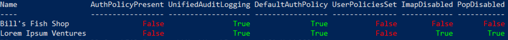

# OCCAM - O365 Configuration Compliance Audit Manager


----

 

OCCAM is an open-source toolkit for testing Office365 tenants against a set of security and compliance best practices. It is built for CSPs managing multiple tenants, though a future version will allow for use without CSP membership.

## Install

OCCAM can be installed via the PowerShell Gallery:

```ps1
Install-Module -Name occam
```

## Usage

:warning: Currently the O365 commands this module relies on are only supported on Windows

Import the module and run the `Invoke-Occam` command to begin an Occam audit.

```ps1
Import-Module occam
Invoke-Occam -UserPrincipalName person@example.com
```

If you do not use the `-UserPrincipalName` or `-UPN` parameter, you will be prompted to enter your CSP-level User Principal Name. A modern auth workflow will be launched to authenticate with your CSP credentials. At that point, you will be prompted to select what tenents you wish to audit. Progress bars will indicate status, and final output is similar to the following example:



The output will also be saved to a CSV with an execution timestamp.

## Default Rules

A set of pre-made best practices have been bundled with this module. They include:

1. `Find-ExplicitAuthPolicyUsers` - Finds any users not using the organization's implicit authentication policy and (if any) exports the list as CSV
2. `Test-BasicAuthPolicies` - Checks to ensure that authentication policies block basic authentication mechanisms
3. `Test-PopImap` - Checks for any users that have POP or IMAP enabled and exports a CSV list of them
4. `Test-UnifiedAuditLogging` - Checks that Unified Audit Logging is enabled on the tenant

Additional rules can be added by creating a file ending in `.Rule.ps1` in the directory from which you invoke OCCAM. Rulesets are dynamically evaluated at run-time.

If you wish to ignore all default rules entirely, you can use the `-NoDefaultRules` switch:

```ps1
Invoke-Occam -NoDefaultRules
```

## Writing Custom Rules

A Rule is any PowerShell script that returns a hashtable of boolean pass/fail values. Albeit simple, Rules are flexible and powerful - anything you can write in PowerShell can be packaged as a Rule and evaluated against every Office365 tenant you manage.

Any files ending in `.Rule.ps1` in the working directory are discovered and parsed automatically. The name of a `.Rule.ps1` file is expected to have the same name as the function contained within them (e.g., `Test-Something.Rule.ps1` is espected to have a function named `Test-Something` inside).

If a name conflict is found between a custom Rule and a default Rule, the custom Rule takes precedence.

### Rule Execution Environment

Rules are ran in an environment that has the [MSOnline](https://docs.microsoft.com/en-us/powershell/module/msonline/) and [ExchangeOnlineManagement](https://docs.microsoft.com/en-us/powershell/exchange/exchange-online-powershell-v2) modules pre-loaded and authenticated to the given tenant the Rule is being evaluated against. All cmdlets and functions in those modules are available for immediate use.

There is no need for MSOnline commands to use the `-TenantId` parameter, as this value is dynamically injected with the ID of the tenant being audited. This means that you can call `Get-MsolUsers` or related functions and it will automatically return a collection scoped to the desired tenant!

### Environment Variables

OCCAM exposes custom environment variables that are available for use in your custom Rules. They are in the same form as the built-in PowerShell `env:` drive, and can be accessed accordingly:

```ps1
Write-Host $OCCAM:TenantName
```

The following OCCAM environment variables are avalable for use:

| Variable                 | Description                                                 | Example                                                                                      |
|--------------------------|-------------------------------------------------------------|----------------------------------------------------------------------------------------------|
| $OCCAM:TenantName        | Office 365 Tenant Name                                      | Contoso Corp                                                                                 |
| $OCCAM:TenantId          | Tenant ID (GUID format)                                     | `b3d628ab-3271-4cc5-bd84-ce69d0946ec6`                                                         |
| $OCCAM:TenantDomain      | Tenant's Primary Domain                                     | contoso.onmicrosoft.com                                                                      |
| $OCCAM:RuleName          | Name of the rule currently being evaluated                  | Test-UnifiedAuditLogging                                                                     |
| $OCCAM:OutputDir         | Output directory scoped to current tenant and rule          | `Office365 Security Audit - 2021-01-13_15_18_06/Contoso Corp/Test-UnifiedAuditLogging` |
| $OCCAM:AuthenticatedUser | User Principal Name of the account used for Exchange Online | steve@example.com                                                                            |

### Rule Output

Rules are expected to return a hashtable of key/value pairs corresponding to the test case(s) the Rule evaluates. Each value is expected to be a boolean, as Rules are meant to evaluate to a simple Pass/Fail criteria.

```ps1
@{
  ImapDisabled = $false
  PopDisabled = $true
}
```

### Exporting as CSV

If more robust information is needed (e.g., a list of authentication policies with Basic Auth enabled), it is suggested to export that information as a CSV. Any files that a rule generates should be created by using the `$OCCAM:OutputDir` relative path that is provided. The `$OCCAM:OutputDir` path is unique for each invocation, tenant, _and_ rule, and it follows the following format:

```txt
<directory with invocation timestamp>\<Office 365 Tenant Name>\<Rule Name>
```

Your Rule is responsible for creating the directory path using `New-Item`. The following example snippet gets a list of users and exports it as CSV. Assuming a customer name of `Contoso Corp` and a rule name of `Test-MyCustomRule`, the following code would generate a CSV file at `./Office365 Security Audit - 2021-01-13_15_18_06/Contoso Corp/Test-MyCustomRule/users.csv`.

```ps1
$Users = Get-MsolUsers
New-Item -ItemType Directory -Force -Path $OCCAM:OutputDir | Out-Null
$Users | ConvertTo-Csv -NoTypeInformation | Out-File ('{0}/users.csv' -f $OCCAM:OutputDir) -Force
```

### Rule Metadata

OCCAM uses PowerShell's built-in Help syntax to dynamically gain metadata about each Rule. The `.SYNOPSIS` help value is presented to the user during runtime in a PowerShell progress bar. This helps provide the user with an indication of what action is being performed, which is important for longer-running Rules. Any string is supported, but it is best to keep the string short and descriptive.

The `.OUTPUTS` help value is expected to contain a list of keys matching exactly the keys present in the hashtable the Rule returns. Each output key is to be separated by a new line.

The following is an example of the `Test-PopImap` Rule that is pre-packaged with OCCAM. It contains a synopsis, two outputs, and makes use of an ExchangeOnlineManagement cmdlet:

```ps1
<#
.SYNOPSIS
Test that POP and IMAP are disabled on all mailbox plans

.OUTPUTS
ImapDisabled
PopDisabled
#>
function Test-PopImap {
    $MailboxPlans = Get-CasMailboxPlan
    $output = @{
      ImapDisabled = !(@($MailboxPlans.ImapEnabled) -contains $true)
      PopDisabled = !(@($MailboxPlans.PopEnabled) -contains $true)
    }
    return $output
}
```
